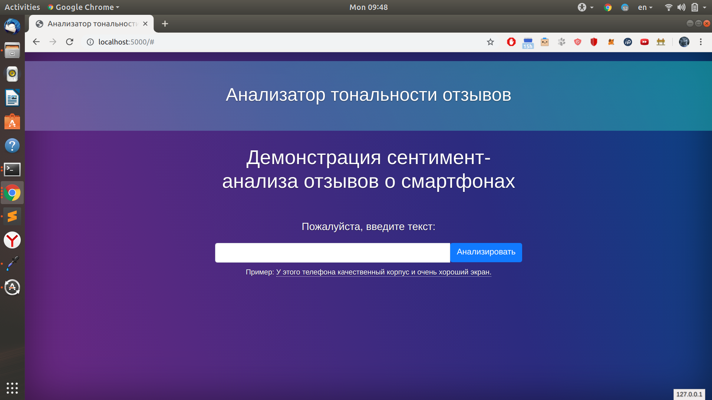
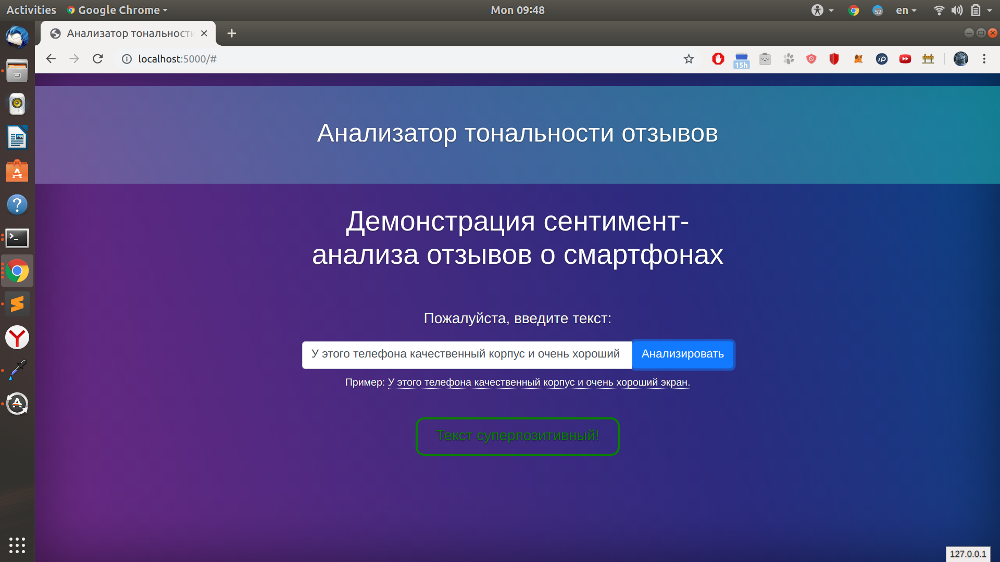
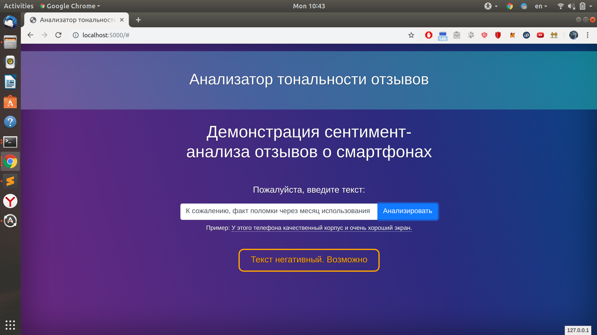

# Coursera Data Analysis Final Project 
### Sentiment Classifier Service
This service analyzes semantics of Russian reviews about smartphones.

## Examples




## How to launch
1. Clone repository

```bash
git clone https://github.com/AntonBorzenko/DataAnalysisFinalProject
```

2. Run server.py
```bash
cd DataAnalysisFinalProject/src/
python3 server.py
```
3. Open [http://localhost:5000](http://localhost:5000)